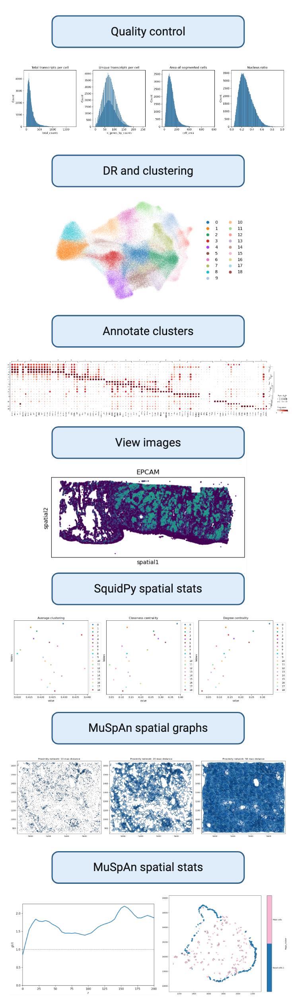

# AirScape : STx analysis pipeline

This repo provides the analysis pipeline and code used to generate the figures to Sara Patti's thesis project - AirScape - at Imperial College London (2023-2026)

# AirScape project

## Research Question

What cell-to-cell interactions and molecular mechanisms drive airway remodeling across chronic respiratory diseases?

## Project Aims

1. Map the transcriptomic landscape of the airway wall in IPF, COPD, and SA
to determine similarities and differences in spatial organization in lung tissue from
patients.

2. Define interactions between stromal, epithelial, and immune cells in
samples from IPF, COPD, and SA patients using imaging mass cytometry.

3. Integration of multi-omic datasets from Aim 1 and Aim 2 with clinical parameters related to respiratory disease to identify mechanistic features that underpin pathology.

# Overview

## Background

- Over 545M worldwide with chronic respiratory disease
- Chronic obstructive pulmonary disease (COPD) and idiopathic pulmonary fibrosis (IPF) among leading causes of respiratory-related mortality
- Shared progressive lung function decline and tissue remodeling
- Driven by inflammation and fibrosis
- Cellular and molecular mechanisms poorly defined, precluding development of new therapeutics

## Samples and methods

Spatial transcriptomics (STx) using the Xenium platform provides single-cell resolution transcriptomics of 5100 genes. In this study, we have patient lung biopsies from control, COPD, and IPF patients. Biopsies are from the proximal (COPD and control MICA III) and distal (IPF and control PM08) airways.

Biopsies have been sectioning for the following:

1. H&E
2. STx
3. IMC
4. IF

# Analysis

## Pre-analysis

1. Format Xenium data by re-naming the cell segmentation markers to be complient with squidpy naming expectations using `/src/batch_rename/xenium_batch_rename.py`
2. Correct any ROI ID names if needed (e.g Three MICA III samples were captured as one ROI so renamed them to their individual donor names) using `src/manual_src/format/cellID_rename.py` run on the HPC with `HPC_jobs/rename_ROI.sh`

## QC to coarse annotation

Run recode_st pipeline using relevant .toml to perform the following analysis:

1. QC: `src/recode_st/qc.py`
2. Dimensionality reductions: `src/recode_st/dimension_reduction.py`
3. Annotation: Run recode_st pipeline `src/recode_st/annotate.py` to identify and map level 1 annotation (major cell types).

## High resolution annotation

1. Separate each cell subset at level 1 annotation by running `HPC_jobs/01_celltype_subset.sh` which calls `src/manual_src/misc_analysis/01_celltype_subset.py`
2. Determine correct number of clusters for level 2 and level 3 annotation for each major cell type. Run `HPC_jobs/annotation/02_celltype_level_resolution.sh` to call `src/manual_src/annotation/02_celltype_level_resolution.py` to determine suitable resolution and manual annotate clusters for level 2 and level 3
3. Map cell type labels to clusters for level 2 and level 3 by running `HPC_jobs/03_map_celltype.sh`to call `src/manual_src/annotation/03_map_celltype_levels.py`
4. Combine all annotations and map back to full adata by running `HPC_jobs/annotation/04_combine_annotate.sh` to call `src/manual_src/annotation/04_combine_annotation.py`

## Downstream analysis

## Spatial transcriptomics

This analysis pipeline is for spatial transcriptomics (10X Xenium platform).

### Spatial transcriptomics analysis pipeline

The pipeline covers preprocessing, quality control, dimensionality reduction, clustering, annotation, viewing spatial images, and spatial statistics (squidpy and MuSpAn).

Cell segmentation is *not* included in this pipeline as it is performed prior to the analysis using the 10X Genomics Xenium software. If you would like to segment the cells yourself, please refer to the [10X Genomics Nucleus and Cell Segmentation Algorithms](https://www.10xgenomics.com/support/software/xenium-onboard-analysis/latest/algorithms-overview/segmentation) for more information.

### Best Practices for Software Engineering

In addition to the analysis pipeline, we highlight several good software engineering practices including version control, containarization, linting, and continuous integration. Details on these practices and how to implement them can be found in the [Best Practices for Software Engineering](docs/3_RSE_best_practices.md) section of the documentation.

### Author information

This pipeline was developed at Imperial College London by *Sara Patti* in
collaboration with *Adrian D'Alessandro* from Research Software Engineering.

## Roadmap 🗺️

### Preprocessing & Quality Control

Goal: Ensure clean, usable spatial gene expression data.

It is critical to preprocess and perform quality control on the data before proceeding with analysis. This step ensures that the data is clean, usable, and of high quality by removing low quality cells and low quality transcripts.

Steps:

- Calculate quality metrics
- Filter low-quality genes and cells
- Normalize and transform gene counts

### Dimensionality Reduction & Clustering

Goal: Identify patterns and groups of similar gene expression profiles.

Dimensionality Reduction a technique used to reduce the number of features (or dimensions) in a dataset while preserving important information. Clustering is a technique used to group similar data points together based on their features. It is critical to determine the most accurate number of clusters to ensure that the clusters are meaningful and representative of the data.

Steps:

- Compute PCA and neighbors
- Compute and plot UMAP
- Cluster cells using Leiden algorithms
- Visualize clusters on UMAP

### Annotation & Cell Type Identification

Goal: Assign biological meaning to clusters.

Annotation is the process of assigning biological meaning to clusters. This typically equates to assigning a cell type identification to each clusters. is the process of identifying the cell types present in the data. Choosing the number of clusters can be challenging and can be seen as more of an art than a science. It is important to choose the number of clusters that best represents the data and the biological question being asked. More information on how to choose the number of clusters can be found in the [scRNAseq best practices](https://www.sc-best-practices.org/cellular_structure/clustering.html).

Steps:

- Compute differentially expressed genes for each cluster
- Visualize cluster marker genes
- Identify cell types with marker genes
- Annotate clusters with known cell types

### Spatial Mapping & Visualization

Goal: Map gene expression and clusters back to their spatial context.

- Overlay expression and clusters on tissue image
- Plot spatially enriched genes
- Map cell types or states in space

### Spatial Statistics & Spatially Variable Genes

Goal: Quantify spatial patterns and variability utilizing spatial statistics.

We use two different approaches to spatial statistics: Squidpy and MuSpAn.

#### Squidpy

- Construct spatial networks
- Spatial autocorrelation (e.g. Moran's I)
- Neighborhood Enrichment

#### MuSpAn

- Construct spatial networks
- Cross-PCF pairwise comparison

There are several additional spatial statistics methods available in MuSpAn, including:

- wPCF pairwise comparison
- Spatial autocorrelation (Hotspot Analysis)
- Ripley's K
- Neighborhood Enrichment
- Community detection
- Network filteration
- Comparing Networks

### Further analysis

We have included several potential downstream analysis methods in this pipeline to discover meaningful biological insights. Below are additional analysis approaches one could use to build on the methods mentioned above.

- DE between regions or conditions
- Pathway analysis (e.g. GSEA, ORA)
- Spatially variable genes (e.g `SpatialDE`)
- Drug-to-cell interactions (e.g`Drug2Cell`)
- Ligand-receptor interactions (e.g `SOAPy`)

and more...

## Best Practice Notes 📝

- Version control (git)
- Virtual environments
- Modularity and modularization
- Code documentation
- Code style, linters, and code formatters
- Continuous integration and continuous deployments
- Code testing
- Configuration management with [Pydantic](https://docs.pydantic.dev/latest/)

## Licence 📄

This project is licensed under the [BSD-3-Clause license](https://github.com/ImperialCollegeLondon/ReCoDe-spatial-transcriptomics/blob/main/LICENSE.md).
